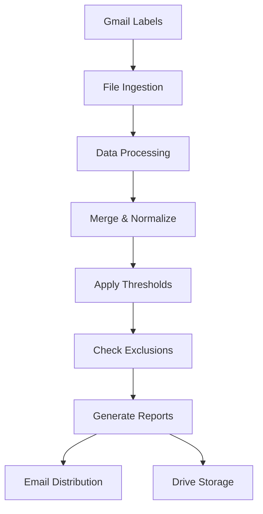

<<<<<<< HEAD

# CM360 Audit System

CM360 Audit System is a robust Google Apps Script solution that automates Campaign Manager 360 (CM360) campaign audits and operational workflows. It aggregates daily delivery files, merges and flags issues against configurable thresholds, honors per‑team exclusions, and distributes results via formatted Excel attachments and summary emails. A simple spreadsheet UI provides configuration management, ad‑hoc run controls, and request handling.

## Overview
The system is designed for reliability and low‑maintenance operation inside Google Workspace:
- Gmail label–based ingestion of daily audit files (ZIP, CSV, XLSX)
- Deterministic merge + header detection + data cleaning
- Flexible flagging by thresholds (clicks > impressions, out‑of‑flight, pixel‑size mismatch, default ad serving)
- Per‑config recipients with optional “withhold no‑flag emails” behavior
- Exclusions by placement ID, site name, or name fragment
- Daily summary email with status across configs
- External configuration spreadsheet support, including writable INSTRUCTIONS columns

## Architecture and data flow
1. Delivery files arrive in Gmail under labels like `Daily Audits/CM360/<CONFIG>`.
2. The script pulls today’s attachments, extracts ZIPs, converts Excel (via Advanced Drive API), and stages files in Drive.
3. Files are merged into a canonical sheet; headers are detected and normalized; pixel sizes are standardized.
4. Flagging logic evaluates thresholds and exclusions; flagged rows are sorted to the top.
5. Stakeholders receive a formatted Excel export and an HTML summary for each config; a global daily summary is also sent.

## Key components
- `Code.js` — Core logic: ingestion, merge, flagging, email/reporting, configuration writers, UI/menu wiring
- `ConfigPicker.html` — Modal dialog for selecting and running audits by config
- `Dashboard.html` — Sidebar dashboard for quick access and status
- `appsscript.json` — Apps Script manifest (scopes, settings)

## Configuration
- External config sheet: set `EXTERNAL_CONFIG_SHEET_ID` in `Code.js`.
- Sheet names (defaults):
	- Thresholds: `Audit Thresholds`
	- Exclusions: `Audit Exclusions`
	- Recipients: `Audit Recipients`
	- Requests: `Audit Requests`
- INSTRUCTIONS writers: the script can write curated two‑column guidance into fixed columns on each sheet.
- Staging and recipients:
	- `STAGING_MODE`: when `Y`, emails route to `ADMIN_EMAIL`.
	- Recipients sheet supports `Withhold No‑Flag Emails` to suppress emails on clean runs.
- Gmail labels: each config in `auditConfigs` references a label such as `Daily Audits/CM360/PST01`.

## Setup
You can operate purely in the Apps Script editor, or use `clasp` for local development.

Option A — Apps Script editor
1) Create/open the Apps Script project bound to your spreadsheet.
2) Add files: paste `Code.js` and add HTML files (`ConfigPicker.html`, `Dashboard.html`).
3) Replace the manifest with `appsscript.json` (scopes will auto‑prompt).
4) In Services, enable Advanced Drive API (required for Excel→Sheets conversion). If disabled, CSV flows still work; Excel imports will be skipped.
5) Save and authorize the script on first run as prompted.

Option B — Local with `clasp`
```powershell
npm install -g @google/clasp
clasp login
git clone https://github.com/evan-schneider/cm360-audit-system.git
Set-Location .\cm360-audit-system
clasp clone <scriptId>   # or clasp pull if already linked
clasp push
```

## Operating
- On spreadsheet open, a custom menu is added with environment setup, sheet management, request tools, batch runners, and utilities.
- Use “Prepare Environment” (Admin Controls → Prepare Environment) to auto-create Gmail labels and Drive folders for all configs that are missing them.
	- Creates Gmail labels (does not create Gmail filters; set up mail routing separately).
	- Creates or repairs Drive folder paths for Merged Reports and Temp Daily Reports per config.
	- Shows a summary of actions and any suggested follow-ups.
- Use the batch runner functions (`runDailyAuditsBatch1..N`) via the menu to run audits, or install daily triggers with “Setup & Install Batch Triggers”.
- “Update External Config Instructions” writes curated guidance to INSTRUCTIONS columns in the external spreadsheet.
- A daily summary email is sent once all configs finish (lock‑protected to avoid duplicates).

## Thresholds and exclusions
- Thresholds: per‑flag minimum impressions/clicks (e.g., for clicks > impressions, out‑of‑flight, pixel mismatch, default ad serving).
- Exclusions: by placement ID, site, or name fragment; can be limited by flag type and config or applied globally.
- Recipients: control primary/CC, active status, and no‑flag email suppression per config.

## Permissions and APIs
- Built‑in services: GmailApp, DriveApp, SpreadsheetApp, HtmlService, CacheService, LockService, PropertiesService, UrlFetchApp.
- Advanced Drive API: required for Excel import (conversion). If not enabled, the script skips Excel conversion and proceeds with available CSVs.

## Troubleshooting
- Missing Gmail label: ensure filters route messages to the expected label path; the setup tool can create labels but not Gmail filters.
- Drive API not enabled: you’ll see “Skipped: Drive API not enabled”; enable Advanced Drive API in Services.
- Header not found: confirm your reports include canonical headers (e.g., Advertiser, Campaign, Site, Placement, Placement ID, Start/End Date, Creative, Impressions, Clicks).
- No files found: verify delivery occurred today and the label path matches the config.
- Email quota: the script caches and reports remaining quota; large recipient lists can exhaust daily limits.

## Version control and releases (optional)
When histories diverge (e.g., `main` vs `master`), use a clean clone and merge with unrelated histories:
```powershell
git fetch origin
git checkout -b merge-master
git merge origin/main --allow-unrelated-histories
$files = git diff --name-only --diff-filter=U
foreach ($f in $files) { git checkout --theirs -- $f; git add $f }
git commit -m "Merge origin/main into master: resolved conflicts by taking origin/main versions"
git push origin HEAD:master
```

## Contributing
Bug reports and PRs are welcome. For larger changes, open an issue to discuss approach and scope.

## License
MIT (see `LICENSE`).

## Adding a new config (exact steps)

Follow these exact steps to add a new config to the system. Mistakes in the `auditConfigs` entry will cause the script to skip that config or fail folder resolution.

1. Open `Code.js` in your editor.
2. Find the `auditConfigs` array near the top of the file (it contains objects like `PST01`, `PST02`, ...).
3. Add a new object to the array with these required properties:
	 - `name`: short uppercase code (e.g., `ENT02`).
	 - `label`: Gmail label path used to collect that config's daily files (e.g., `Daily Audits/CM360/ENT02`).
	 - `mergedFolderPath`: an array representing the Drive path where merged reports will be saved. Use the helper `folderPath(type, configName)` or provide an array like `['Project Log Files','CM360 Daily Audits','Merged Reports','ENT02']`.
	 - `tempDailyFolderPath`: an array representing the Drive path where inbound temp files will be staged (similar shape to `mergedFolderPath`).

Exact example — copy & paste into `auditConfigs` (insert as a new element):

```javascript
{
	name: 'ENT02',
	label: 'Daily Audits/CM360/ENT02',
	mergedFolderPath: folderPath('Merged Reports', 'ENT02'),
	tempDailyFolderPath: folderPath('Temp Daily Reports', 'ENT02')
}
```

Notes:
- Use `folderPath('Merged Reports', '<NAME>')` to match the project's default folder layout and avoid typos.
- The `label` must match an existing Gmail label (you can create it manually or run "Prepare Environment" from the menu which will create labels). Creating the label does not automatically create a Gmail filter; ensure reporting emails are labeled correctly by your mail routing rules.
- After adding the object, either:
	- Click the menu: Admin Controls → Prepare Environment (recommended), or
	- Run `prepareAuditEnvironment()` from the Apps Script editor
	This will create the Gmail label and Drive folders for the new config if they don't already exist.
- Run `installDailyAuditTriggers()` or use the menu "Setup & Install Batch Triggers" to create triggers for the updated config set.

Verification steps
- In Apps Script editor run `validateAuditConfigs()` — it should not throw errors for the new config.
- Run `prepareAuditEnvironment()` — verify the merged folder appears in Drive and the Gmail label is present.
- Manually run `runDailyAuditByName('<NAME>')` to test end-to-end for a config (use today's delivery or a small test ZIP/CSV).

If you want, paste the new config here and I can add it and run the setup commands for you.
=======
# CM360 Audit System

[](https://opensource.org/licenses/MIT)
[](https://script.google.com)
[](https://github.com/evan-schneider/cm360-audit-system/commits/master)
[](http://makeapullrequest.com)

> **Enterprise-grade automated Campaign Manager 360 (CM360) audit system built with Google Apps Script for large-scale campaign monitoring, anomaly detection, and stakeholder reporting.**

## 🚀 Overview

The CM360 Audit System is a robust Google Apps Script solution that automates Campaign Manager 360 (CM360) campaign audits and operational workflows. It aggregates daily delivery files, merges and flags issues against configurable thresholds, honors per‑team exclusions, and distributes results via formatted Excel attachments and summary emails. A simple spreadsheet UI provides configuration management, ad‑hoc run controls, and request handling.

### ✨ Key Features

- 📧 **Gmail Integration** - Automated ingestion of daily audit files via Gmail labels
- 📊 **Smart Data Processing** - Handles ZIP, CSV, and XLSX files with automatic conversion
- ⚡ **Real-time Flagging** - Configurable thresholds for clicks > impressions, flight dates, pixel sizes
- 👥 **Multi-team Support** - Per-config recipients with customizable notification preferences
- 🚫 **Advanced Exclusions** - Flexible exclusion rules by placement ID, site name, or fragments
- 📈 **Professional Reporting** - Formatted Excel exports with HTML summaries
- 🔧 **Admin Controls** - Built-in environment setup and maintenance tools

## 🏗️ Architecture



### Data Flow
1. **Ingestion**: Delivery files arrive in Gmail under labels like `Daily Audits/CM360/<CONFIG>`
2. **Processing**: Script pulls attachments, extracts ZIPs, converts Excel files, stages in Drive
3. **Merging**: Files merged into canonical sheet with header detection and normalization
4. **Analysis**: Flagging logic evaluates thresholds and exclusions, sorts flagged rows to top
5. **Distribution**: Stakeholders receive formatted Excel exports and HTML summaries

## 📁 Project Structure

```
├── Code.js                 # 🧠 Core logic: ingestion, merge, flagging, email/reporting
├── ConfigPicker.html       # 🎛️ Modal dialog for config selection and audit runs
├── Dashboard.html          # 📊 Sidebar dashboard for quick access and status
├── ButtonsSidebar.html     # ⚙️ Admin controls and utilities
├── AdminRefreshPrompt.html # 🔄 Admin refresh confirmation dialog
├── appsscript.json        # ⚙️ Apps Script manifest (scopes, settings)
├── package.json           # 📦 Node.js dependencies and scripts
├── README.md              # 📖 This documentation
├── CONTRIBUTING.md        # 🤝 Contribution guidelines
├── SECURITY.md           # 🔒 Security policy and reporting
└── .github/              # 🏗️ Issue templates and workflows
```

## ⚙️ Configuration

### External Configuration Sheet
Set `EXTERNAL_CONFIG_SHEET_ID` in `Code.js` to use an external configuration spreadsheet.

### Default Sheet Names
- **Thresholds**: `Audit Thresholds`
- **Exclusions**: `Audit Exclusions` 
- **Recipients**: `Audit Recipients`
- **Requests**: `Audit Requests`

### Environment Settings
- **STAGING_MODE**: Set to `Y` to route all emails to `ADMIN_EMAIL` for testing
- **Recipients**: Configure per-config email lists with "Withhold No‑Flag Emails" support
- **Gmail Labels**: Each config references a label path like `Daily Audits/CM360/PST01`

## 🚀 Quick Start

### Option A: Apps Script Editor
1. Create/open Apps Script project bound to your spreadsheet
2. Add files: paste `Code.js` and add HTML files
3. Replace manifest with `appsscript.json` contents
4. Enable Advanced Drive API in Services (for Excel conversion)
5. Save and authorize on first run

### Option B: Local Development with clasp
```bash
# Install clasp globally
npm install -g @google/clasp

# Clone this repository
git clone https://github.com/evan-schneider/cm360-audit-system.git
cd cm360-audit-system

# Install dependencies
npm install

# Login to Google (one-time setup)
npm run login

# Link to your Apps Script project
clasp clone <your-script-id>

# Deploy changes
npm run deploy
```

## 🎯 Usage

### Initial Setup
1. **Prepare Environment**: Use menu item *Admin Controls → Prepare Environment*
   - Auto-creates Gmail labels for all configs
   - Creates Drive folder structure
   - Shows setup summary and next steps

2. **Configure Triggers**: Use *Setup & Install Batch Triggers* to create daily automation

3. **Test Configuration**: Run individual configs via *🧪 [TEST] Run Batch or Config*

### Daily Operations
- **Automated**: Daily triggers run batch audits and send reports
- **Manual**: Use ConfigPicker dialog for ad-hoc runs
- **Monitoring**: Dashboard shows recent activity and status
- **Maintenance**: Admin tools for placement name updates and config validation

## 📊 Thresholds and Exclusions

### Threshold Configuration
Set minimum impression/click counts for various flag types:
- Clicks > Impressions detection
- Out-of-flight date validation  
- Pixel size mismatch alerts
- Default ad serving notifications

### Exclusion Rules
Configure exclusions by:
- **Placement ID**: Exact match exclusions
- **Site Name**: Full site name matching
- **Name Fragment**: Partial name matching
- **Flag Type**: Limit exclusions to specific audit types
- **Config Scope**: Global or per-config exclusions

## 🔧 API Requirements

### Built-in Services
- **GmailApp**: Email processing and sending
- **DriveApp**: File storage and organization
- **SpreadsheetApp**: Data processing and configuration
- **HtmlService**: UI components and reporting

### Advanced APIs
- **Drive API v2**: Required for Excel → Sheets conversion
  - Enable in Apps Script Services
  - Automatic fallback to CSV-only if disabled

## 🔒 Security & Permissions

### Required OAuth Scopes
- `https://www.googleapis.com/auth/spreadsheets`
- `https://www.googleapis.com/auth/drive` 
- `https://www.googleapis.com/auth/gmail.readonly`
- `https://www.googleapis.com/auth/gmail.send`
- `https://www.googleapis.com/auth/gmail.modify`

### Security Best Practices
- External config spreadsheets should have appropriate sharing restrictions
- Gmail label filters should be configured by workspace administrators
- Regular monitoring of Apps Script execution logs recommended
- Use staging mode for testing to prevent accidental data exposure

## 🐛 Troubleshooting

### Common Issues

| Issue | Solution |
|-------|----------|
| Missing Gmail label | Ensure filters route to expected label; use Prepare Environment tool |
| Drive API errors | Enable Advanced Drive API in Services |
| Header not found | Verify reports include canonical headers (Advertiser, Campaign, etc.) |
| No files found | Check delivery occurred today and label path matches config |
| Email quota exceeded | Monitor quota in logs; consider recipient list optimization |

### Debug Tools
- **Validate Configs**: Check configuration integrity
- **Authorization Status**: Verify API permissions  
- **Placement Name Updates**: Refresh placement data from latest reports
- **External Instructions**: Sync configuration guidance

## 🤝 Contributing

We welcome contributions! Please see our [Contributing Guidelines](CONTRIBUTING.md) for details on:
- Code style and standards
- Development setup
- Testing procedures  
- Pull request process

For bugs and feature requests, please use our [issue templates](.github/ISSUE_TEMPLATE/).

## 📄 License

This project is licensed under the MIT License - see the [LICENSE](LICENSE) file for details.

## 🔒 Security

Security issues should be reported privately to evan.schneider98@gmail.com. Please see our [Security Policy](SECURITY.md) for details.

## 📞 Support

- 📋 **Issues**: [GitHub Issues](https://github.com/evan-schneider/cm360-audit-system/issues)
- 💬 **Discussions**: [GitHub Discussions](https://github.com/evan-schneider/cm360-audit-system/discussions)  
- 📧 **Contact**: evan.schneider98@gmail.com

---

<p align="center">
  <strong>Built with ❤️ for digital marketing teams</strong><br>
  <sub>Automate your CM360 audits and focus on optimization</sub>
</p>
>>>>>>> origin/master
