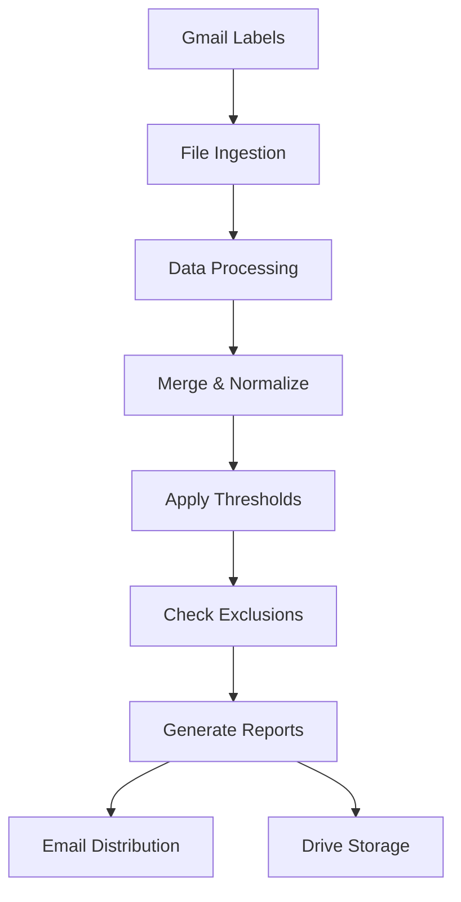

# CM360 Audit System

[](https://opensource.org/licenses/MIT)
[](https://script.google.com)
[](https://github.com/evan-schneider/cm360-audit-system/commits/master)
[](http://makeapullrequest.com)

> **Enterprise-grade automated Campaign Manager 360 (CM360) audit system built with Google Apps Script for large-scale campaign monitoring, anomaly detection, and stakeholder reporting.**

## 🚀 Overview

The CM360 Audit System is a robust Google Apps Script solution that automates Campaign Manager 360 (CM360) campaign audits and operational workflows. It aggregates daily delivery files, merges and flags issues against configurable thresholds, honors per‑team exclusions, and distributes results via formatted Excel attachments and summary emails. A simple spreadsheet UI provides configuration management, ad‑hoc run controls, and request handling.

### ✨ Key Features

- 📧 **Gmail Integration** - Automated ingestion of daily audit files via Gmail labels
- 📊 **Smart Data Processing** - Handles ZIP, CSV, and XLSX files with automatic conversion
- ⚡ **Real-time Flagging** - Configurable thresholds for clicks > impressions, flight dates, pixel sizes
- 👥 **Multi-team Support** - Per-config recipients with customizable notification preferences
- 🚫 **Advanced Exclusions** - Flexible exclusion rules by placement ID, site name, or fragments
- 📈 **Professional Reporting** - Formatted Excel exports with HTML summaries
- 🔧 **Admin Controls** - Built-in environment setup and maintenance tools

## 🏗️ Architecture



### Data Flow
1. **Ingestion**: Delivery files arrive in Gmail under labels like `Daily Audits/CM360/<CONFIG>`
2. **Processing**: Script pulls attachments, extracts ZIPs, converts Excel files, stages in Drive
3. **Merging**: Files merged into canonical sheet with header detection and normalization
4. **Analysis**: Flagging logic evaluates thresholds and exclusions, sorts flagged rows to top
5. **Distribution**: Stakeholders receive formatted Excel exports and HTML summaries

## 📁 Project Structure

```
├── Code.js                 # 🧠 Core logic: ingestion, merge, flagging, email/reporting
├── ConfigPicker.html       # 🎛️ Modal dialog for config selection and audit runs
├── Dashboard.html          # 📊 Sidebar dashboard for quick access and status
├── ButtonsSidebar.html     # ⚙️ Admin controls and utilities
├── AdminRefreshPrompt.html # 🔄 Admin refresh confirmation dialog
├── appsscript.json        # ⚙️ Apps Script manifest (scopes, settings)
├── package.json           # 📦 Node.js dependencies and scripts
├── README.md              # 📖 This documentation
├── CONTRIBUTING.md        # 🤝 Contribution guidelines
├── SECURITY.md           # 🔒 Security policy and reporting
└── .github/              # 🏗️ Issue templates and workflows
```

## ⚙️ Configuration

### External Configuration Sheet
Set `EXTERNAL_CONFIG_SHEET_ID` in `Code.js` to use an external configuration spreadsheet.

### Default Sheet Names
- **Thresholds**: `Audit Thresholds`
- **Exclusions**: `Audit Exclusions` 
- **Recipients**: `Audit Recipients`
- **Requests**: `Audit Requests`

### Environment Settings
- **STAGING_MODE**: Set to `Y` to route all emails to `ADMIN_EMAIL` for testing
- **Recipients**: Configure per-config email lists with "Withhold No‑Flag Emails" support
- **Gmail Labels**: Each config references a label path like `Daily Audits/CM360/PST01`

## 🚀 Quick Start

### Option A: Apps Script Editor
1. Create/open Apps Script project bound to your spreadsheet
2. Add files: paste `Code.js` and add HTML files
3. Replace manifest with `appsscript.json` contents
4. Enable Advanced Drive API in Services (for Excel conversion)
5. Save and authorize on first run

### Option B: Local Development with clasp
```bash
# Install clasp globally
npm install -g @google/clasp

# Clone this repository
git clone https://github.com/evan-schneider/cm360-audit-system.git
cd cm360-audit-system

# Install dependencies
npm install

# Login to Google (one-time setup)
npm run login

# Link to your Apps Script project
clasp clone <your-script-id>

# Deploy changes
npm run deploy
```

## 🎯 Usage

### Initial Setup
1. **Prepare Environment**: Use menu item *Admin Controls → Prepare Environment*
   - Auto-creates Gmail labels for all configs
   - Creates Drive folder structure
   - Shows setup summary and next steps

2. **Configure Triggers**: Use *Setup & Install Batch Triggers* to create daily automation

3. **Test Configuration**: Run individual configs via *🧪 [TEST] Run Batch or Config*

### Daily Operations
- **Automated**: Daily triggers run batch audits and send reports
- **Manual**: Use ConfigPicker dialog for ad-hoc runs
- **Monitoring**: Dashboard shows recent activity and status
- **Maintenance**: Admin tools for placement name updates and config validation

## 📊 Thresholds and Exclusions

### Threshold Configuration
Set minimum impression/click counts for various flag types:
- Clicks > Impressions detection
- Out-of-flight date validation  
- Pixel size mismatch alerts
- Default ad serving notifications

### Exclusion Rules
Configure exclusions by:
- **Placement ID**: Exact match exclusions
- **Site Name**: Full site name matching
- **Name Fragment**: Partial name matching
- **Flag Type**: Limit exclusions to specific audit types
- **Config Scope**: Global or per-config exclusions

## 🔧 API Requirements

### Built-in Services
- **GmailApp**: Email processing and sending
- **DriveApp**: File storage and organization
- **SpreadsheetApp**: Data processing and configuration
- **HtmlService**: UI components and reporting

### Advanced APIs
- **Drive API v2**: Required for Excel → Sheets conversion
  - Enable in Apps Script Services
  - Automatic fallback to CSV-only if disabled

## 🔒 Security & Permissions

### Required OAuth Scopes
- `https://www.googleapis.com/auth/spreadsheets`
- `https://www.googleapis.com/auth/drive` 
- `https://www.googleapis.com/auth/gmail.readonly`
- `https://www.googleapis.com/auth/gmail.send`
- `https://www.googleapis.com/auth/gmail.modify`

### Security Best Practices
- External config spreadsheets should have appropriate sharing restrictions
- Gmail label filters should be configured by workspace administrators
- Regular monitoring of Apps Script execution logs recommended
- Use staging mode for testing to prevent accidental data exposure

## 🐛 Troubleshooting

### Common Issues

| Issue | Solution |
|-------|----------|
| Missing Gmail label | Ensure filters route to expected label; use Prepare Environment tool |
| Drive API errors | Enable Advanced Drive API in Services |
| Header not found | Verify reports include canonical headers (Advertiser, Campaign, etc.) |
| No files found | Check delivery occurred today and label path matches config |
| Email quota exceeded | Monitor quota in logs; consider recipient list optimization |

### Debug Tools
- **Validate Configs**: Check configuration integrity
- **Authorization Status**: Verify API permissions  
- **Placement Name Updates**: Refresh placement data from latest reports
- **External Instructions**: Sync configuration guidance

## 🤝 Contributing

We welcome contributions! Please see our [Contributing Guidelines](CONTRIBUTING.md) for details on:
- Code style and standards
- Development setup
- Testing procedures  
- Pull request process

For bugs and feature requests, please use our [issue templates](.github/ISSUE_TEMPLATE/).

## 📄 License

This project is licensed under the MIT License - see the [LICENSE](LICENSE) file for details.

## 🔒 Security

Security issues should be reported privately to evan.schneider98@gmail.com. Please see our [Security Policy](SECURITY.md) for details.

## 📞 Support

- 📋 **Issues**: [GitHub Issues](https://github.com/evan-schneider/cm360-audit-system/issues)
- 💬 **Discussions**: [GitHub Discussions](https://github.com/evan-schneider/cm360-audit-system/discussions)  
- 📧 **Contact**: evan.schneider98@gmail.com

---

<p align="center">
  <strong>Built with ❤️ for digital marketing teams</strong><br>
  <sub>Automate your CM360 audits and focus on optimization</sub>
</p>